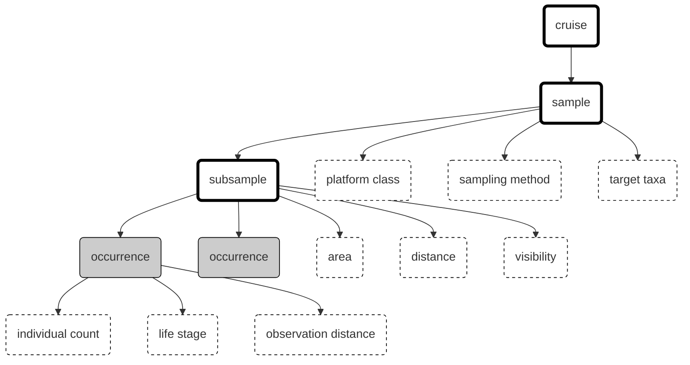

# Animal movement data

## Model

```mermaid
flowchart 

cruise("cruise"):::event
sample("sample"):::event
subsample("subsample"):::event

occ1("occurrence"):::occurrence
occ2("occurrence"):::occurrence

platformclass("platform class"):::mof
samplingmethod("sampling method"):::mof
ttaxa("target taxa"):::mof
area("area"):::mof
distance("distance"):::mof
visibility("visibility"):::mof
icount("individual count"):::mof
lifestage("life stage"):::mof
obsdistance("observation distance"):::mof


classDef event fill:#fff,stroke-width:4px,stroke:#000;
classDef occurrence fill:#ccc,stroke-width:1px,stroke:#000;
classDef mof fill:#fff,stroke-width:1px,stroke:#000,stroke-dasharray:4;

cruise --> sample
    sample --> subsample
    sample --> platformclass
    sample --> samplingmethod
    sample --> ttaxa
        subsample --> occ1
            occ1--> icount
            occ1 --> lifestage
            occ1 --> obsdistance
        subsample --> occ2

        subsample --> area
        subsample --> distance
        subsample --> visibility
```