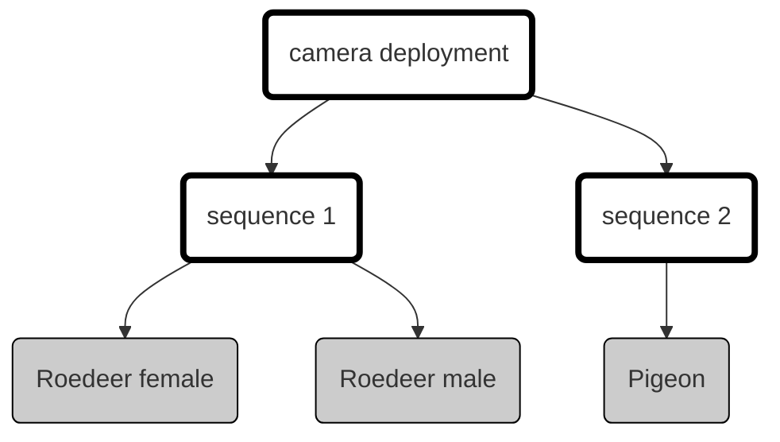

# Camera trap data

## Model

```mermaid
flowchart
    classDef event fill:#fff,stroke-width:4px,stroke:#000;
    classDef occurrence fill:#ccc,stroke-width:1px,stroke:#000;
    classDef mof fill:#fff,stroke-width:1px,stroke:#000,stroke-dasharray:4;

    dep1("camera deployment"):::event
    seq1("sequence 1"):::event
    seq2("sequence 2"):::event
    obs1("Roedeer female"):::occurrence
    obs2("Roedeer male"):::occurrence
    obs3("Pigeon"):::occurrence

    dep1 --> seq1
      seq1 --> obs1
      seq1 --> obs2
    dep1 --> seq2
      seq2 --> obs3
```
