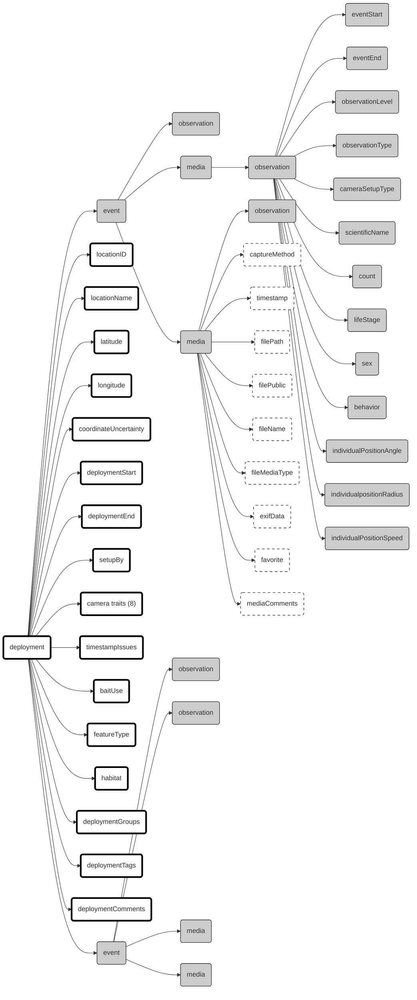

# Camera trap data

## Model camtrap DP 

```mermaid
flowchart LR
    deployment("deployment"):::deployment
    event1("event"):::observation
    event2("event"):::observation

    obs1("observation"):::observation
    obs2("observation"):::observation
    obs3("observation"):::observation
    obs4("observation"):::observation
    obs5("observation"):::observation

    media1("media"):::observation
    media2("media"):::observation
    media3("media"):::observation
    media4("media"):::observation

    locationID("locationID"):::deployment
    locationName("locationName"):::deployment
    latitude("latitude"):::deployment
    longitude("longitude"):::deployment
    coordinateUncertainty("coordinateUncertainty"):::deployment
    deploymentStart("deploymentStart"):::deployment
    deploymentEnd("deploymentEnd"):::deployment
    setupBy("setupBy"):::deployment
    cameratraits("camera traits (8)"):::deployment
    timestampIssues("timestampIssues"):::deployment
    baitUse("baitUse"):::deployment
    featureType("featureType"):::deployment
    habitat("habitat"):::deployment
    deploymentGroups("deploymentGroups"):::deployment
    deploymentTags("deploymentTags"):::deployment
    deploymentComments("deploymentComments"):::deployment

    eventStart("eventStart"):::observation
    eventEnd("eventEnd"):::observation
    observationLevel("observationLevel"):::observation
    observationType("observationType"):::observation
    cameraSetupType("cameraSetupType"):::observation
    scientificName("scientificName"):::observation
    count("count"):::observation
    lifeStage("lifeStage"):::observation
    sex("sex"):::observation
    behavior("behavior"):::observation
    individualpositionRadius("individualpositionRadius"):::observation
    individualPositionAngle("individualPositionAngle"):::observation
    individualPositionSpeed("individualPositionSpeed"):::observation

    captureMethod("captureMethod"):::media
    timestamp("timestamp"):::media
    filePath("filePath"):::media
    filePublic("filePublic"):::media
    fileName("fileName"):::media
    fileMediaType("fileMediaType"):::media
    exifData("exifData"):::media
    favorite("favorite"):::media
    mediaComments("mediaComments"):::media

    classDef deployment fill:#fff,stroke-width:4px,stroke:#000;
    classDef observation fill:#ccc,stroke-width:1px,stroke:#000;
    classDef media       fill:#fff,stroke-width:1px,stroke:#000, stroke-dasharray:6;

deployment --> event1

deployment --> locationID
deployment --> locationName
deployment --> latitude
deployment --> longitude
deployment --> coordinateUncertainty
deployment --> deploymentStart
deployment --> deploymentEnd
deployment --> setupBy
deployment --> cameratraits
deployment --> timestampIssues
deployment --> baitUse
deployment --> featureType
deployment --> habitat
deployment --> deploymentGroups
deployment --> deploymentTags
deployment --> deploymentComments

    event1 --> obs1
    event1 --> media1
        media1 --> obs2
    event1 --> media2
        media2 --> obs3
        media2 --> captureMethod
        media2 --> timestamp
        media2 --> filePath
        media2 --> filePublic
        media2 --> fileName
        media2 --> fileMediaType
        media2 --> exifData
        media2 --> favorite
        media2 --> mediaComments


deployment --> event2
    event2 --> obs4
    event2 --> obs5
        obs2 --> eventStart
        obs2 --> eventEnd
        obs2 --> observationLevel
        obs2 --> observationType
        obs2 --> cameraSetupType
        obs2 --> scientificName
        obs2 --> count
        obs2 --> lifeStage
        obs2 --> sex
        obs2 --> behavior
        obs2 --> individualPositionAngle
        obs2 --> individualpositionRadius
        obs2 --> individualPositionSpeed
    
    event2 --> media3
    event2 --> media4
```

