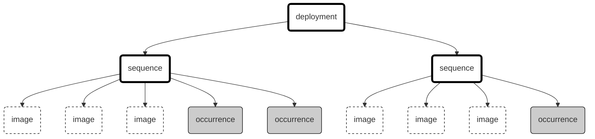

# Camera trap data

## Model

```mermaid
flowchart
    deployment("deployment"):::event
    seq1("sequence"):::event
    seq2("sequence"):::event
    occ1("occurrence"):::occurrence
    occ2("occurrence"):::occurrence
    occ3("occurrence"):::occurrence
    multi1("image"):::multimedia
    multi2("image"):::multimedia
    multi3("image"):::multimedia
    multi4("image"):::multimedia
    multi5("image"):::multimedia
    multi6("image"):::multimedia
    

    classDef event fill:#fff,stroke-width:4px,stroke:#000;
    classDef occurrence fill:#ccc,stroke-width:1px,stroke:#000;
    classDef multimedia fill:#fff,stroke-width:1px,stroke:#000,stroke-dasharray:4;

    deployment --> seq1
        seq1 --> multi1
        seq1 --> multi2
        seq1 --> multi3
        seq1 --> occ1
        seq1 --> occ2

    deployment --> seq2
        seq2 --> multi4
        seq2 --> multi5
        seq2 --> multi6
        seq2 --> occ3
```

