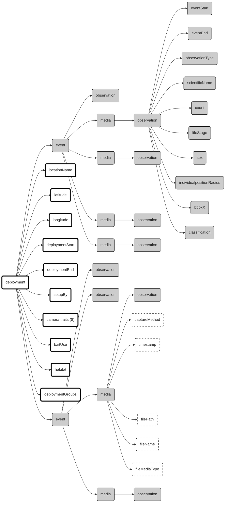

```mermaid
flowchart LR
    deployment("deployment"):::deployment
    event1("event"):::observation
    event2("event"):::observation

    obs1("observation"):::observation
    obs2("observation"):::observation
    obs3("observation"):::observation
    obs4("observation"):::observation
    obs5("observation"):::observation
    obs6("observation"):::observation
    obs7("observation"):::observation
    obs8("observation"):::observation
    obs9("observation"):::observation
    

    media1("media"):::observation
    media2("media"):::observation
    media3("media"):::observation
    media4("media"):::observation
    media5("media"):::observation
    media6("media"):::observation

    locationName("locationName"):::deployment
    latitude("latitude"):::deployment
    longitude("longitude"):::deployment
    deploymentStart("deploymentStart"):::deployment
    deploymentEnd("deploymentEnd"):::deployment
    setupBy("setupBy"):::deployment
    cameratraits("camera traits (8)"):::deployment
    baitUse("baitUse"):::deployment
    habitat("habitat"):::deployment
    deploymentGroups("deploymentGroups"):::deployment

    eventStart("eventStart"):::observation
    eventEnd("eventEnd"):::observation
    observationType("observationType"):::observation
    scientificName("scientificName"):::observation
    count("count"):::observation
    lifeStage("lifeStage"):::observation
    sex("sex"):::observation
    individualpositionRadius("individualpositionRadius"):::observation
    bboxX("bboxX"):::observation
    classification("classification"):::observation

    captureMethod("captureMethod"):::media
    timestamp("timestamp"):::media
    filePath("filePath"):::media
    fileName("fileName"):::media
    fileMediaType("fileMediaType"):::media

    classDef deployment fill:#fff,stroke-width:4px,stroke:#000;
    classDef observation fill:#ccc,stroke-width:1px,stroke:#000;
    classDef media       fill:#fff,stroke-width:1px,stroke:#000, stroke-dasharray:6;

deployment --> event1

deployment --> locationName
deployment --> latitude
deployment --> longitude
deployment --> deploymentStart
deployment --> deploymentEnd
deployment --> setupBy
deployment --> cameratraits
deployment --> baitUse
deployment --> habitat
deployment --> deploymentGroups


    event1 --> obs1
    event1 --> media1
        media1 --> obs2
    event1 --> media2
        media2 --> obs3
    event1 --> media3
        media3 --> obs4
    event1 --> media4
        media4 --> obs5


deployment --> event2
    event2 --> obs6
    event2 --> obs7
        obs2 --> eventStart
        obs2 --> eventEnd
        obs2 --> observationType
        obs2 --> scientificName
        obs2 --> count
        obs2 --> lifeStage
        obs2 --> sex
        obs2 --> individualpositionRadius
        obs2 --> bboxX
        obs2 --> classification
    
    event2 --> media5
        media5 --> obs8
        media5 --> captureMethod
        media5 --> timestamp
        media5 --> filePath
        media5 --> fileName
        media5 --> fileMediaType
    event2 --> media6
        media6 --> obs9
```
