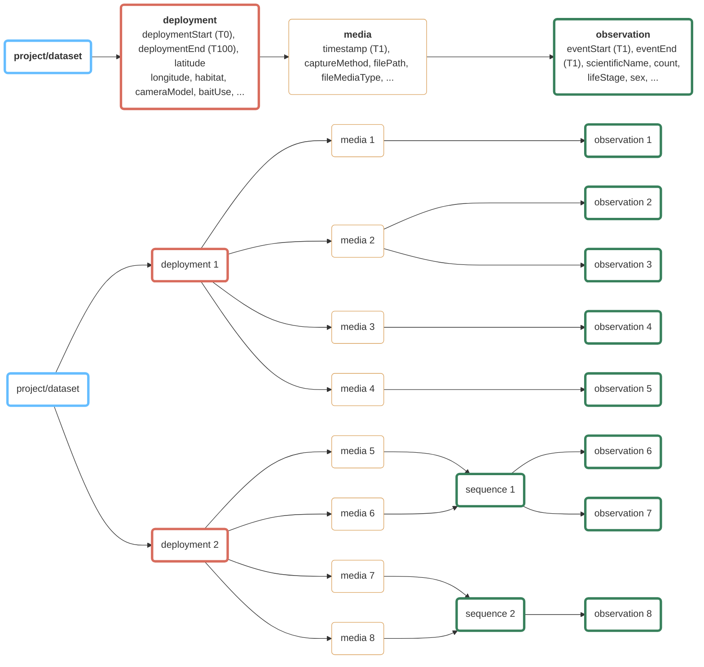

```mermaid
flowchart LR
    classDef prj_event fill:#fff,stroke:#65BDFF,stroke-width:4px;
    classDef dep_event fill:#fff,stroke:#D86C5D,stroke-width:4px;
    classDef med_file fill:#fff,stroke:#DAA25E,stroke-width:1px;
    classDef obs_event fill:#fff,stroke:#37805B,stroke-width:4px;
    classDef seq_event fill:#fff,stroke:#37805B,stroke-width:4px;

    prj0("`**project/dataset**`"):::prj_event
    dep0("`**deployment**
        deploymentStart (T0), deploymentEnd (T100), latitude
        longitude, habitat, cameraModel, baitUse, ...`"):::dep_event
    med0("`**media**
        timestamp (T1), captureMethod, filePath, fileMediaType, ...`"):::med_file
    obs0("`**observation**
        eventStart (T1), eventEnd (T1), scientificName, count, lifeStage, sex, ...`"):::obs_event
    prj0 --> dep0 --> med0 ---> obs0

    prj1("project/dataset"):::prj_event
    
    dep1("deployment 1"):::dep_event
    med1("media 1"):::med_file
    med2("media 2"):::med_file
    med3("media 3"):::med_file
    med4("media 4"):::med_file
    obs1("observation 1"):::obs_event
    obs2("observation 2"):::obs_event
    obs3("observation 3"):::obs_event
    obs4("observation 4"):::obs_event
    obs5("observation 5"):::obs_event
    prj1 --> dep1
    dep1 --> med1
    dep1 --> med2
    dep1 --> med3
    dep1 --> med4
    med1 ---> obs1
    med2 ---> obs2
    med2 ---> obs3
    med3 ---> obs4
    med4 ---> obs5

    dep2("deployment 2"):::dep_event
    med5("media 5"):::med_file
    med6("media 6"):::med_file
    med7("media 7"):::med_file
    med8("media 8"):::med_file
    seq1("sequence 1"):::seq_event
    seq2("sequence 2"):::seq_event
    obs6("observation 6"):::obs_event
    obs7("observation 7"):::obs_event
    obs8("observation 8"):::obs_event
    prj1 --> dep2
    dep2 --> med5
    dep2 --> med6
    dep2 --> med7
    dep2 --> med8
    med5 --> seq1
    med6 --> seq1
    med7 --> seq2
    med8 --> seq2
    seq1 --> obs6
    seq1 --> obs7
    seq2 --> obs8
```
