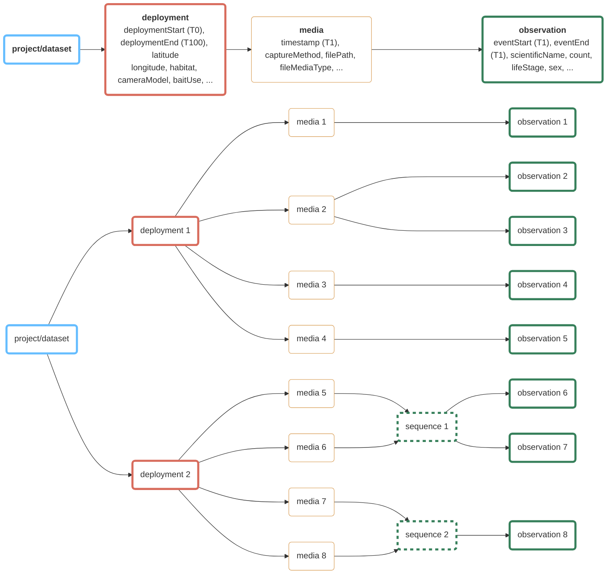

```mermaid
flowchart LR
    classDef prj_event fill:#fff,stroke:#65BDFF,stroke-width:4px;
    classDef dep_event fill:#fff,stroke:#D86C5D,stroke-width:4px;
    classDef obs_event fill:#fff,stroke:#37805B,stroke-width:4px;
    classDef seq_event fill:#fff,stroke:#37805B,stroke-width:4px,stroke-dasharray:6;
    classDef med_file fill:#fff,stroke:#DAA25E,stroke-width:1px;

    prj0("`**project/dataset**`"):::prj_event
    dep0("`**deployment**
        deploymentStart (T0), deploymentEnd (T100), latitude
        longitude, habitat, cameraModel, baitUse, ...`"):::dep_event
    medfile0("`**media**
        timestamp (T1), captureMethod, filePath, fileMediaType, ...`"):::med_file
    obs0("`**observation**
        eventStart (T1), eventEnd (T1), scientificName, count, lifeStage, sex, ...`"):::obs_event
    prj0 --> dep0 --> medfile0 ---> obs0

    prj1("project/dataset"):::prj_event
    
    dep1("deployment 1"):::dep_event
    medfile1("media 1"):::med_file
    medfile2("media 2"):::med_file
    medfile3("media 3"):::med_file
    medfile4("media 4"):::med_file
    obs1("observation 1"):::obs_event
    obs2("observation 2"):::obs_event
    obs3("observation 3"):::obs_event
    obs4("observation 4"):::obs_event
    obs5("observation 5"):::obs_event
    prj1 --> dep1
    dep1 --> medfile1
    dep1 --> medfile2
    dep1 --> medfile3
    dep1 --> medfile4
    medfile1 ---> obs1
    medfile2 ---> obs2
    medfile2 ---> obs3
    medfile3 ---> obs4
    medfile4 ---> obs5

    dep2("deployment 2"):::dep_event
    medfile5("media 5"):::med_file
    medfile6("media 6"):::med_file
    medfile7("media 7"):::med_file
    medfile8("media 8"):::med_file
    seq1("sequence 1"):::seq_event
    seq2("sequence 2"):::seq_event
    obs6("observation 6"):::obs_event
    obs7("observation 7"):::obs_event
    obs8("observation 8"):::obs_event
    prj1 --> dep2
    dep2 --> medfile5
    dep2 --> medfile6
    dep2 --> medfile7
    dep2 --> medfile8
    medfile5 --> seq1
    medfile6 --> seq1
    medfile7 --> seq2
    medfile8 --> seq2
    seq1 --> obs6
    seq1 --> obs7
    seq2 --> obs8
```
