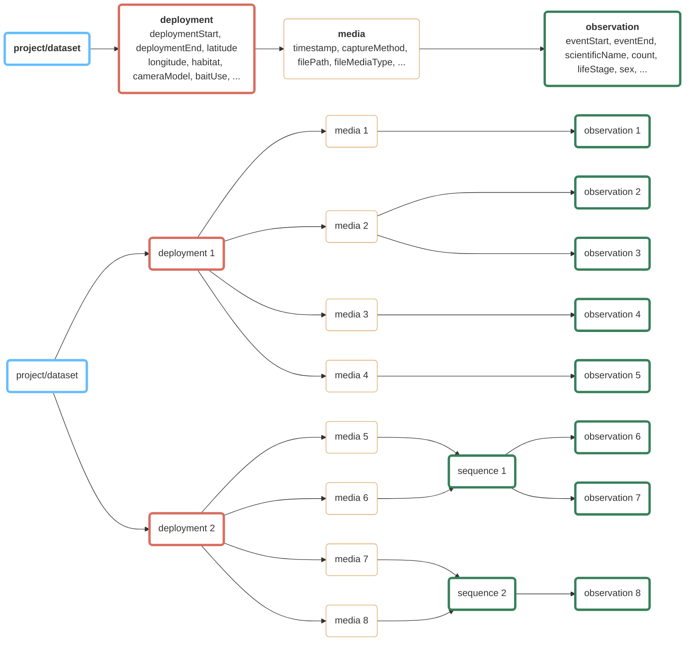

```mermaid
flowchart LR
    classDef prj_event fill:#fff,stroke:#65BDFF,stroke-width:4px;
    classDef dep_event fill:#fff,stroke:#D86C5D,stroke-width:4px;
    classDef med_file fill:#fff,stroke:#DAA25E,stroke-width:1px;
    classDef obs_event fill:#fff,stroke:#37805B,stroke-width:4px;
    classDef seq_event fill:#fff,stroke:#37805B,stroke-width:4px;

    prj0("`**project/dataset**`"):::prj_event
    dep0("`**deployment**
        deploymentStart, deploymentEnd, latitude
        longitude, habitat, cameraModel, baitUse, ...`"):::dep_event
    med0("`**media**
        timestamp, captureMethod, filePath, fileMediaType, ...`"):::med_file
    obs0("`**observation**
        eventStart, eventEnd, scientificName, count, lifeStage, sex, ...`"):::obs_event
    prj0 --> dep0 --> med0 ---> obs0

    prj1("project/dataset"):::prj_event
    
    dep1("deployment 1"):::dep_event
    med1_1("media 1"):::med_file
    med1_2("media 2"):::med_file
    med1_3("media 3"):::med_file
    med1_4("media 4"):::med_file
    obs1_1("observation 1"):::obs_event
    obs1_2a("observation 2"):::obs_event
    obs1_2b("observation 3"):::obs_event
    obs1_3("observation 4"):::obs_event
    obs1_4("observation 5"):::obs_event
    prj1 --> dep1
    dep1 --> med1_1
    dep1 --> med1_2
    dep1 --> med1_3
    dep1 --> med1_4
    med1_1 ---> obs1_1
    med1_2 ---> obs1_2a
    med1_2 ---> obs1_2b
    med1_3 ---> obs1_3
    med1_4 ---> obs1_4

    dep2("deployment 2"):::dep_event
    med2_1("media 5"):::med_file
    med2_2("media 6"):::med_file
    med2_3("media 7"):::med_file
    med2_4("media 8"):::med_file
    seq2_1("sequence 1"):::seq_event
    seq2_2("sequence 2"):::seq_event
    obs2_1("observation 6"):::obs_event
    obs2_2("observation 7"):::obs_event
    obs2_3("observation 8"):::obs_event
    prj1 --> dep2
    dep2 --> med2_1
    dep2 --> med2_2
    dep2 --> med2_3
    dep2 --> med2_4
    med2_1 --> seq2_1
    med2_2 --> seq2_1
    med2_3 --> seq2_2
    med2_4 --> seq2_2
    seq2_1 --> obs2_1
    seq2_1 --> obs2_2
    seq2_2 --> obs2_3
```
