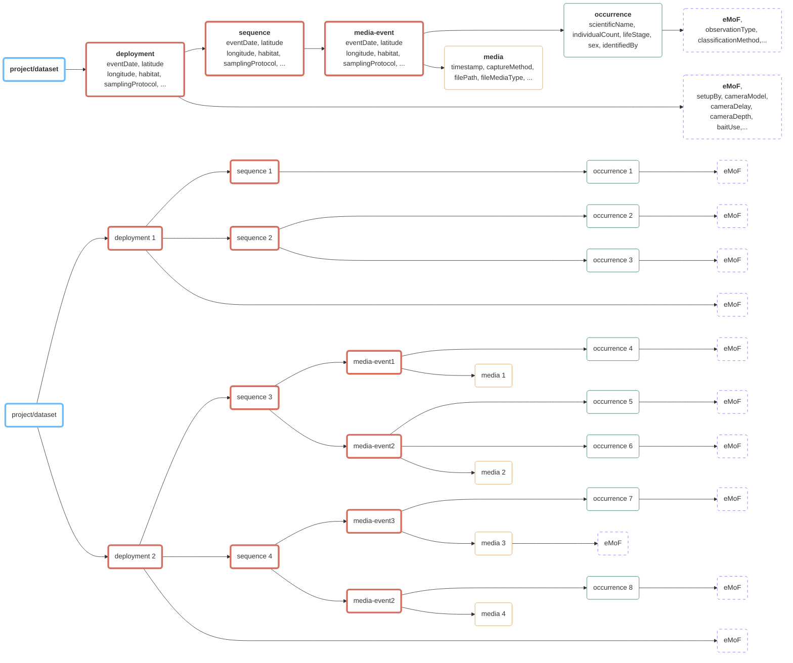

```mermaid
flowchart LR
    classDef prj_event fill:#fff,stroke:#65BDFF,stroke-width:4px;
    classDef dep_event fill:#fff,stroke:#D86C5D,stroke-width:4px;
    classDef seq_event fill:#fff,stroke:#D86C5D,stroke-width:4px;
    classDef media_event fill:#fff,stroke:#D86C5D,stroke-width:4px;
    classDef occ_ext fill:#fff,stroke:#37805B,stroke-width:1px;
    classDef media_ext fill:#fff,stroke:#DAA25E,stroke-width:1px;
    classDef emof_ext fill:#fff,stroke:#896CFF,stroke-width:1px,stroke-dasharray:6;

    prj0("`**project/dataset**`"):::prj_event
    dep0("`**deployment**
        eventDate, latitude
        longitude, habitat, samplingProtocol, ...`"):::dep_event
    seq0("`**sequence**
        eventDate, latitude
        longitude, habitat, samplingProtocol, ...`"):::seq_event
    med0("`**media-event**
        eventDate, latitude
        longitude, habitat, samplingProtocol, ...`"):::media_event
    obs0("`**occurrence**
        scientificName, individualCount, lifeStage, sex, identifiedBy`"):::occ_ext
    aud0("`**media**
        timestamp, captureMethod, filePath, fileMediaType, ...`"):::media_ext
    emof_dep0("`**eMoF**,
        setupBy, cameraModel,
        cameraDelay, cameraDepth, 
        baitUse,...`"):::emof_ext
    emof_obs0("`**eMoF**,
        observationType, classificationMethod,...`"):::emof_ext
       
    prj0 --> dep0 --> seq0 --> med0 ---> obs0
    med0-->aud0
    dep0------>emof_dep0
    obs0--> emof_obs0

    prj1("project/dataset"):::prj_event
    
    dep1("deployment 1"):::dep_event
    dep2("deployment 2"):::dep_event

    seq1_1("sequence 1"):::seq_event
    seq1_2("sequence 2"):::seq_event
    seq2_1("sequence 3"):::seq_event
    seq2_2("sequence 4"):::seq_event

    media2_1a("media-event1"):::media_event
    media2_1b("media-event2"):::media_event
    media2_2a("media-event3"):::media_event
    media2_2b("media-event2"):::media_event


    obs1_1("occurrence 1"):::occ_ext
    obs1_2a("occurrence 2"):::occ_ext
    obs1_2b("occurrence 3"):::occ_ext
    occ2_1a("occurrence 4"):::occ_ext
    occ2_1b1("occurrence 5"):::occ_ext
    occ2_1b2("occurrence 6"):::occ_ext
    occ2_2a("occurrence 7"):::occ_ext
    occ2_2b("occurrence 8"):::occ_ext

    aud2_1a("media 1"):::media_ext
    aud2_1b("media 2"):::media_ext
    aud2_2a("media 3"):::media_ext
    aud2_2b("media 4"):::media_ext

    emof_dep1("eMoF"):::emof_ext
    emof_dep2("eMoF"):::emof_ext
    emof_obs1("eMoF"):::emof_ext
    emof_obs2("eMoF"):::emof_ext
    emof_obs3("eMoF"):::emof_ext
    emof_obs4("eMoF"):::emof_ext
    emof_obs5("eMoF"):::emof_ext
    emof_obs6("eMoF"):::emof_ext
    emof_obs7("eMoF"):::emof_ext
    emof_obs8("eMoF"):::emof_ext
    emof_obs9("eMoF"):::emof_ext

    prj1-->dep1
        dep1 --> seq1_1
            seq1_1---->obs1_1 -->emof_obs1
        dep1 --> seq1_2
            seq1_2---->obs1_2a-->emof_obs2
            seq1_2---->obs1_2b-->emof_obs3
        dep1------>emof_dep1
    prj1-->dep2
        dep2-->seq2_1
            seq2_1-->media2_1a
                media2_1a--->occ2_1a-->emof_obs4
                media2_1a-->aud2_1a
            seq2_1-->media2_1b
                media2_1b--->occ2_1b1-->emof_obs5
                media2_1b--->occ2_1b2-->emof_obs6
                media2_1b-->aud2_1b
        dep2-->seq2_2
            seq2_2-->media2_2a
                media2_2a--->occ2_2a-->emof_obs7
                media2_2a-->aud2_2a-->emof_obs8
            seq2_2-->media2_2b
                media2_2b--->occ2_2b-->emof_obs9
                media2_2b-->aud2_2b
        dep2------>emof_dep2
```
