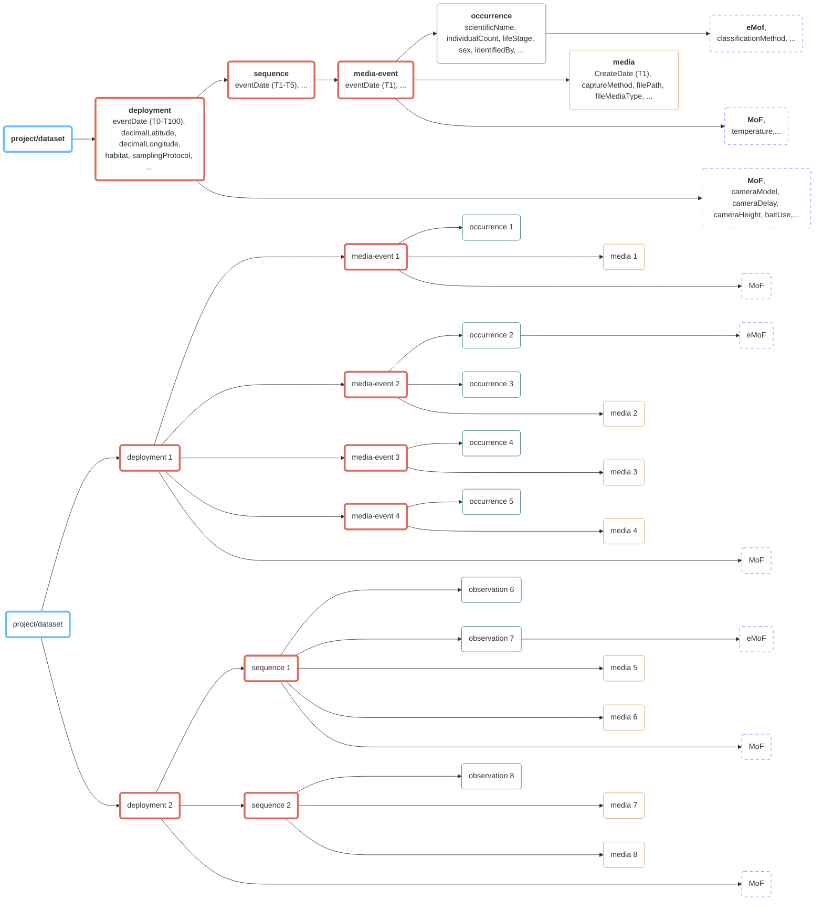

```mermaid
flowchart LR
    classDef prj_event fill:#fff,stroke:#65BDFF,stroke-width:4px;
    classDef dep_event fill:#fff,stroke:#D86C5D,stroke-width:4px;
    classDef seq_event fill:#fff,stroke:#D86C5D,stroke-width:4px;
    classDef media_event fill:#fff,stroke:#D86C5D,stroke-width:4px;
    classDef occ_ext fill:#fff,stroke:#37805B,stroke-width:1px;
    classDef media_ext fill:#fff,stroke:#DAA25E,stroke-width:1px;
    classDef emof_ext fill:#fff,stroke:#896CFF,stroke-width:1px,stroke-dasharray:6;

    prj0("`**project/dataset**`"):::prj_event
    dep0("`**deployment**
        eventDate (T0-T100), decimalLatitude, decimalLongitude,
        habitat, samplingProtocol, ...`"):::dep_event
    seq0("`**sequence**
        eventDate (T1-T5), ...`"):::seq_event
    med0("`**media-event**
        eventDate (T1), ...`"):::media_event
    obs0("`**occurrence**
        scientificName, individualCount, lifeStage, sex, identifiedBy, ...`"):::occ_ext
    aud0("`**media**
        CreateDate (T1), captureMethod, filePath, fileMediaType, ...`"):::media_ext
    emof_dep0("`**MoF**,
        cameraModel, cameraDelay, cameraHeight, baitUse,...`"):::emof_ext
    emof_med0("`**MoF**,
        temperature,...`"):::emof_ext
    emof_obs0("`**eMof**,
        classificationMethod, ...`"):::emof_ext
       
    prj0 --> dep0 --> seq0 --> med0 --> obs0
    med0 ---> aud0
    dep0 ------> emof_dep0
    med0 ----> emof_med0
    obs0 ---> emof_obs0

    prj1("project/dataset"):::prj_event
    
    dep1("deployment 1"):::dep_event
    med1("media-event 1"):::media_event
    med2("media-event 2"):::media_event
    med3("media-event 3"):::media_event
    med4("media-event 4"):::media_event
    obs1("occurrence 1"):::occ_ext
    obs2("occurrence 2"):::occ_ext
    obs3("occurrence 3"):::occ_ext
    obs4("occurrence 4"):::occ_ext
    obs5("occurrence 5"):::occ_ext
    aud1("media 1"):::media_ext
    aud2("media 2"):::media_ext
    aud3("media 3"):::media_ext
    aud4("media 4"):::media_ext
    emof_dep1("MoF"):::emof_ext
    emof_med1("MoF"):::emof_ext
    emof_obs2("eMoF"):::emof_ext
    prj1 --> dep1
    dep1 ---> med1
    dep1 ---> med2
    dep1 ---> med3
    dep1 ---> med4
    med1 --> obs1
    med2 --> obs2
    med2 --> obs3
    med3 --> obs4
    med4 --> obs5
    med1 ---> aud1
    med2 ---> aud2
    med3 ---> aud3
    med4 ---> aud4
    dep1 ------> emof_dep1
    med1 ----> emof_med1
    obs2 ---> emof_obs2
    
    dep2("deployment 2"):::dep_event
    seq1("sequence 1"):::seq_event
    seq2("sequence 2"):::seq_event
    obs6("observation 6"):::occ_ext
    obs7("observation 7"):::occ_ext
    obs8("observation 8"):::occ_ext
    aud5("media 5"):::media_ext
    aud6("media 6"):::media_ext
    aud7("media 7"):::media_ext
    aud8("media 8"):::media_ext
    emof_dep2("MoF"):::emof_ext
    emof_seq1("MoF"):::emof_ext
    emof_obs7("eMoF"):::emof_ext
    prj1 --> dep2
    dep2 --> seq1
    dep2 --> seq2
    seq1 ---> obs6
    seq1 ---> obs7
    seq2 ---> obs8
    seq1 ----> aud5
    seq1 ----> aud6
    seq2 ----> aud7
    seq2 ----> aud8
    dep2 ------> emof_dep2
    seq1 -----> emof_seq1
    obs7 ---> emof_obs7
```
