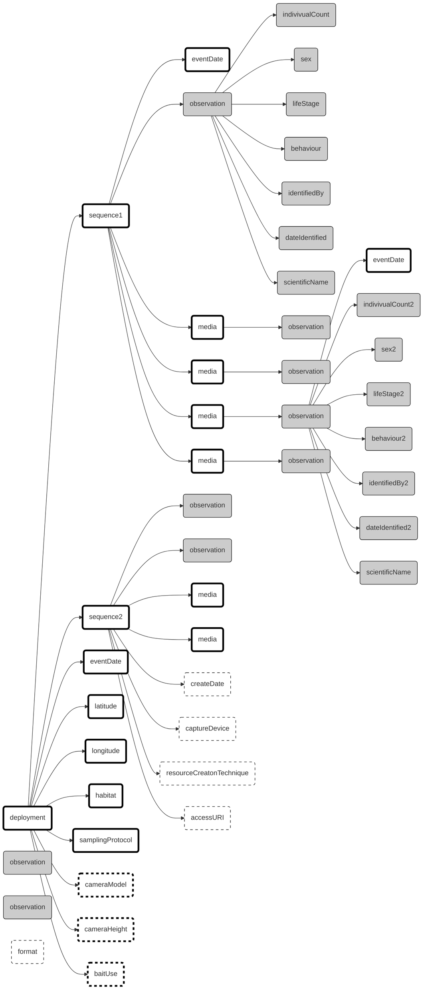

```mermaid
flowchart LR

deployment("deployment"):::event

seq1("sequence1"):::event
seq2("sequence2"):::event
eventDate1("eventDate"):::event
habitat("habitat"):::event
samplingProtocol("samplingProtocol"):::event
latitude("latitude"):::event
longitude("longitude"):::event

media1("media"):::event
media2("media"):::event
media3("media"):::event
media4("media"):::event
media5("media"):::event
media6("media"):::event

eventDate2("eventDate"):::event
eventDate3("eventDate"):::event

obs1("observation"):::occurrence
obs2("observation"):::occurrence
obs3("observation"):::occurrence
obs4("observation"):::occurrence
obs5("observation"):::occurrence
obs6("observation"):::occurrence
obs7("observation"):::occurrence
obs8("observation"):::occurrence
obs9("observation"):::occurrence

indivivualCount("indivivualCount"):::occurrence
sex("sex"):::occurrence
lifeStage("lifeStage"):::occurrence
behaviour("behaviour"):::occurrence
identifiedBy("identifiedBy"):::occurrence
dateIdentified("dateIdentified"):::occurrence
scientificName("scientificName"):::occurrence

indivivualCount2("indivivualCount2"):::occurrence
sex2("sex2"):::occurrence
lifeStage2("lifeStage2"):::occurrence
behaviour2("behaviour2"):::occurrence
identifiedBy2("identifiedBy2"):::occurrence
dateIdentified2("dateIdentified2"):::occurrence
scientificName2("scientificName"):::occurrence

createDate("createDate"):::audubon
captureDevice("captureDevice"):::audubon
resourceCreatonTechnique("resourceCreatonTechnique"):::audubon
accessURI("accessURI"):::audubon
format("format"):::audubon

cameraModel("cameraModel"):::emof
cameraHeight("cameraHeight"):::emof
baitUse("baitUse"):::emof

classDef event fill:#fff,stroke-width:4px,stroke:#000;
classDef occurrence fill:#ccc,stroke-width:1px,stroke:#000;
classDef audubon fill:#fff,stroke-width:1px,stroke:#000, stroke-dasharray:6;
classDef emof fill:#fff,stroke-width:4px,stroke:#000, stroke-dasharray:6;

%% Deployment level

deployment --> seq1
deployment --> seq2

deployment --> eventDate1
deployment --> latitude
deployment --> longitude
deployment --> habitat
deployment --> samplingProtocol

deployment --> cameraModel
deployment --> cameraHeight
deployment --> baitUse

%% Sequence 1
seq1--> eventDate2

seq1 --> obs1
seq1 --> media1
seq1 --> media2
seq1 --> media3
seq1 --> media4

    %% Sequence-based observation 1
    obs1 --> indivivualCount
    obs1 --> sex
    obs1 --> lifeStage
    obs1 --> behaviour
    obs1 --> identifiedBy
    obs1 --> dateIdentified 
    obs1 --> scientificName

    %% Media-based observation 1
        media1 --> obs2
        media2 --> obs3
        media3 --> obs4
            obs4 --> eventDate3
            obs4 --> indivivualCount2
            obs4 --> sex2
            obs4 --> lifeStage2
            obs4 --> behaviour2
            obs4 --> identifiedBy2
            obs4 --> dateIdentified2
            obs4 --> scientificName2
        media4 --> obs5


%% Sequence 2
seq2 --> obs6
seq2 --> obs7
seq2 --> media5
seq2 --> media6

seq2 --> createDate
seq2 --> captureDevice
seq2 --> resourceCreatonTechnique
seq2 --> accessURI
```
seq2 --> format

    %% Media-based observation 2
    media5 --> obs8
    media6 --> obs9
