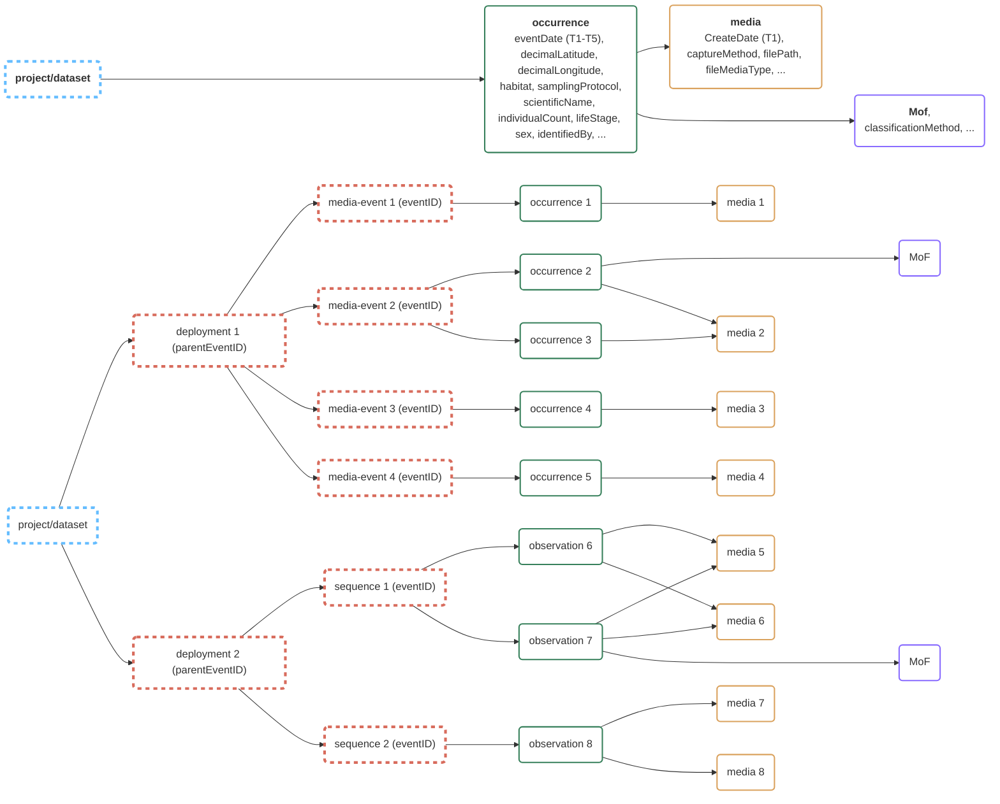

```mermaid
flowchart LR
    classDef prj_event fill:#fff,stroke:#65BDFF,stroke-width:4px,stroke-dasharray:6;
    classDef dep_event fill:#fff,stroke:#D86C5D,stroke-width:4px,stroke-dasharray:6;
    classDef seq_event fill:#fff,stroke:#D86C5D,stroke-width:4px,stroke-dasharray:6;
    classDef media_event fill:#fff,stroke:#D86C5D,stroke-width:4px,stroke-dasharray:6;
    classDef occ_core fill:#fff,stroke:#37805B,stroke-width:2px;
    classDef media_ext fill:#fff,stroke:#DAA25E,stroke-width:2px;
    classDef emof_ext fill:#fff,stroke:#896CFF,stroke-width:2px;

    prj0("`**project/dataset**`"):::prj_event
    obs0("`**occurrence**
        eventDate (T1-T5), decimalLatitude, decimalLongitude,
        habitat, samplingProtocol,
        scientificName, individualCount, lifeStage, sex, identifiedBy, ...`"):::occ_core
    aud0("`**media**
        CreateDate (T1), captureMethod, filePath, fileMediaType, ...`"):::media_ext
    mof_obs0("`**Mof**,
        classificationMethod, ...`"):::emof_ext
       
    prj0 ----> obs0 --> aud0
    obs0 ---> mof_obs0

    prj1("project/dataset"):::prj_event
    
    dep1("deployment 1 (parentEventID)"):::dep_event
    med1("media-event 1 (eventID)"):::media_event
    med2("media-event 2 (eventID)"):::media_event
    med3("media-event 3 (eventID)"):::media_event
    med4("media-event 4 (eventID)"):::media_event
    obs1("occurrence 1"):::occ_core
    obs2("occurrence 2"):::occ_core
    obs3("occurrence 3"):::occ_core
    obs4("occurrence 4"):::occ_core
    obs5("occurrence 5"):::occ_core
    aud1("media 1"):::media_ext
    aud2("media 2"):::media_ext
    aud3("media 3"):::media_ext
    aud4("media 4"):::media_ext
    emof_obs2("MoF"):::emof_ext
    prj1 --> dep1
    dep1 --> med1
    dep1 --> med2
    dep1 --> med3
    dep1 --> med4
    med1 --> obs1
    med2 --> obs2
    med2 --> obs3
    med3 --> obs4
    med4 --> obs5
    obs1 --> aud1
    obs2 ---> emof_obs2
    obs2 --> aud2
    obs3 --> aud2
    obs4 --> aud3
    obs5 --> aud4
    
    dep2("deployment 2 (parentEventID)"):::dep_event
    seq1("sequence 1 (eventID)"):::seq_event
    seq2("sequence 2 (eventID)"):::seq_event
    obs6("observation 6"):::occ_core
    obs7("observation 7"):::occ_core
    obs8("observation 8"):::occ_core
    aud5("media 5"):::media_ext
    aud6("media 6"):::media_ext
    aud7("media 7"):::media_ext
    aud8("media 8"):::media_ext
    emof_obs7("MoF"):::emof_ext
    prj1 --> dep2
    dep2 --> seq1
    dep2 --> seq2
    seq1 --> obs6
    seq1 --> obs7
    seq2 --> obs8
    obs6 --> aud5
    obs6 --> aud6
    obs7 --> aud5
    obs7 --> aud6
    obs8 --> aud7
    obs8 --> aud8
    obs7 ---> emof_obs7
```
