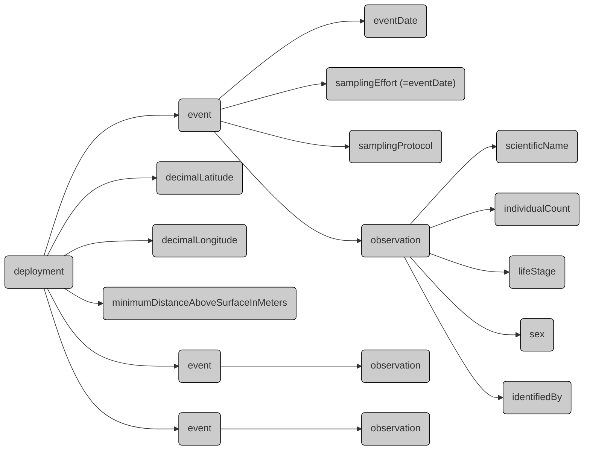

```mermaid
flowchart LR
    deployment("deployment"):::occurrence
    event1("event"):::occurrence
    event2("event"):::occurrence
    event3("event"):::occurrence

    occ1("observation"):::occurrence
    occ2("observation"):::occurrence
    occ3("observation"):::occurrence

    scientificName("scientificName"):::occurrence
    individualCount("individualCount"):::occurrence
    lifeStage("lifeStage"):::occurrence
    sex("sex"):::occurrence
    identifiedBy("identifiedBy"):::occurrence

    eventDate("eventDate"):::occurrence
    samplingEffort("samplingEffort (=eventDate)"):::occurrence
    samplingProtocol("samplingProtocol"):::occurrence

    decimalLatitude("decimalLatitude"):::occurrence
    decimalLongitude("decimalLongitude"):::occurrence
    minimumDistanceAboveSurfaceInMeters("minimumDistanceAboveSurfaceInMeters"):::occurrence

    
   

    classDef occurrence fill:#ccc,stroke-width:1px,stroke:#000;

    deployment --> event1
    deployment --> decimalLatitude
    deployment --> decimalLongitude
    deployment --> minimumDistanceAboveSurfaceInMeters
        event1 --> eventDate
        event1 --> samplingEffort
        event1 --> samplingProtocol

        event1 --> occ1
            occ1 --> scientificName
            occ1 -->individualCount
            occ1 -->lifeStage
            occ1 -->sex
            occ1 -->identifiedBy

    deployment --> event2
            event2 --> occ2

    deployment --> event3
            event3 --> occ3
```
