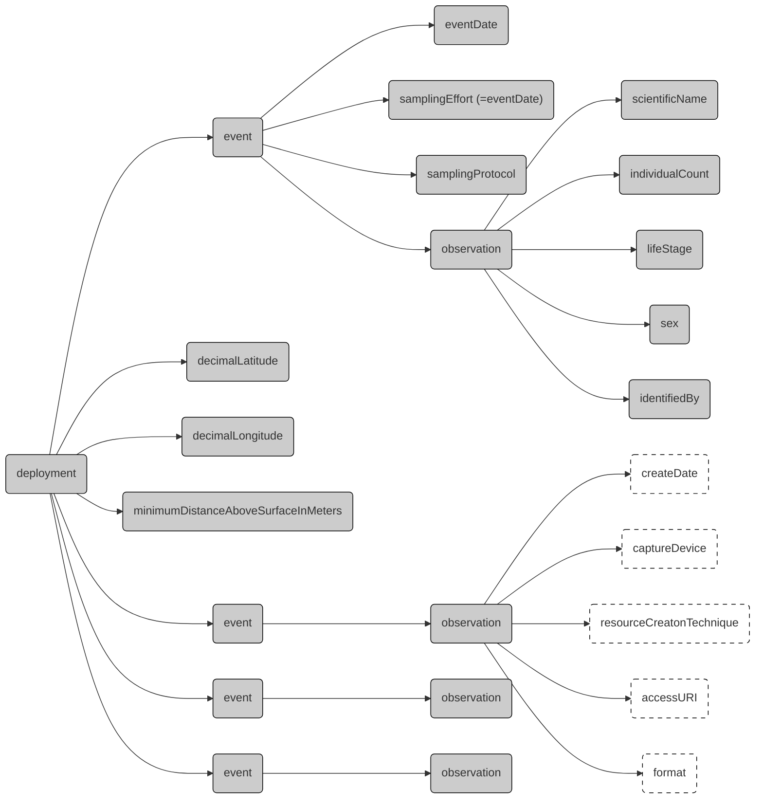

```mermaid
flowchart LR
    deployment("deployment"):::occurrence
    event1("event"):::occurrence
    event2("event"):::occurrence
    event3("event"):::occurrence
    event4("event"):::occurrence


    occ1("observation"):::occurrence
    occ2("observation"):::occurrence
    occ3("observation"):::occurrence
    occ4("observation"):::occurrence

    scientificName("scientificName"):::occurrence
    individualCount("individualCount"):::occurrence
    lifeStage("lifeStage"):::occurrence
    sex("sex"):::occurrence
    identifiedBy("identifiedBy"):::occurrence

    eventDate("eventDate"):::occurrence
    samplingEffort("samplingEffort (=eventDate)"):::occurrence
    samplingProtocol("samplingProtocol"):::occurrence

    decimalLatitude("decimalLatitude"):::occurrence
    decimalLongitude("decimalLongitude"):::occurrence
    minimumDistanceAboveSurfaceInMeters("minimumDistanceAboveSurfaceInMeters"):::occurrence

    createDate("createDate"):::audubon
    captureDevice("captureDevice"):::audubon
    resourceCreatonTechnique("resourceCreatonTechnique"):::audubon
    accessURI("accessURI"):::audubon
    format("format"):::audubon
   

    classDef occurrence fill:#ccc,stroke-width:1px,stroke:#000;
    classDef audubon fill:#fff,stroke-width:1px,stroke:#000, stroke-dasharray:6;


    deployment --> event1
    deployment --> decimalLatitude
    deployment --> decimalLongitude
    deployment --> minimumDistanceAboveSurfaceInMeters
        event1 --> eventDate
        event1 --> samplingEffort
        event1 --> samplingProtocol

        event1 --> occ1
            occ1 --> scientificName
            occ1 -->individualCount
            occ1 -->lifeStage
            occ1 -->sex
            occ1 -->identifiedBy

    deployment --> event2
            event2 --> occ2
            occ2 --> createDate
            occ2 --> captureDevice
            occ2 --> resourceCreatonTechnique
            occ2 --> accessURI
            occ2 --> format

    deployment --> event3
            event3 --> occ3

    deployment --> event4
        event4 --> occ4
```
